# Deploy-a-node-js-application-push-into-the-dockerhub-registry
To build a docker image using dockerfile and deploy a node docker image on another machine and push into dockerhub registry.

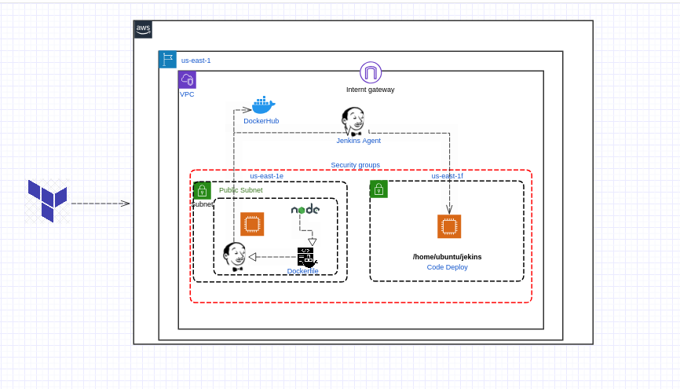

**_let see examples of How we do a deployment..._**

- Launch a two ec2 machine for this project.....I attached a terraform file to create a machines.

- Using ssh login into master machine....Once check, is everything installed ? What we mentioned in the user data.
   java and jenkins...

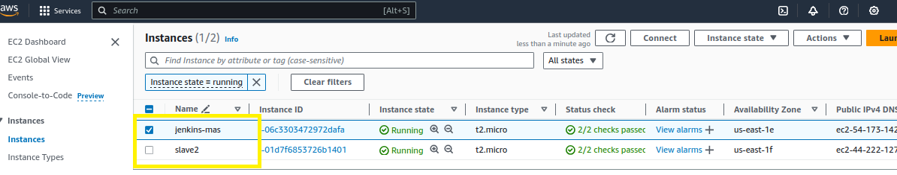
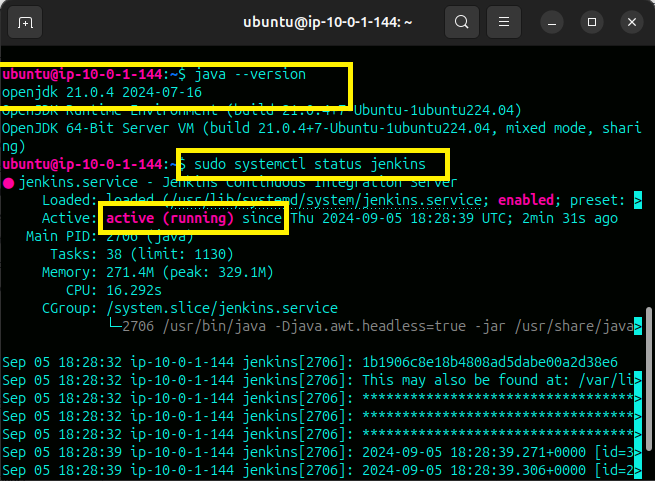

- Using the ip of master machine trigeer on web...

   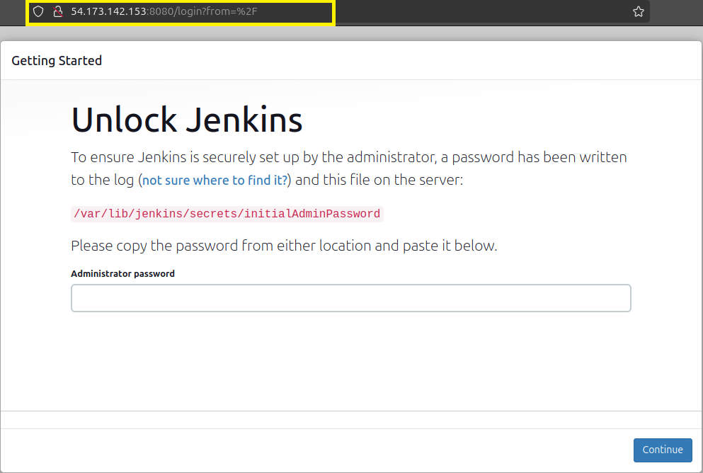

- Then add a slave node on master jenkins..

   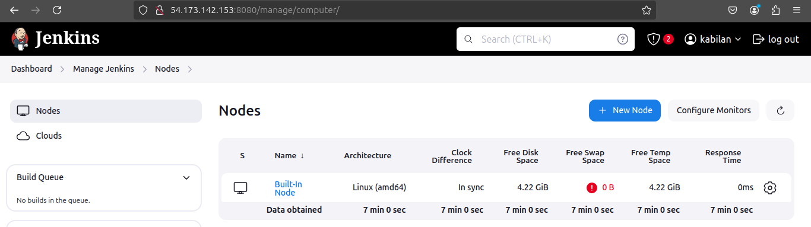
   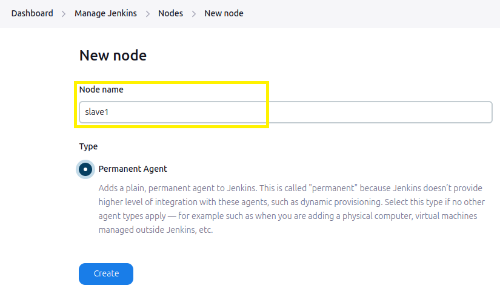

- Give a proper username, ssh private key When connect a slave node...Here I added a slave node.

   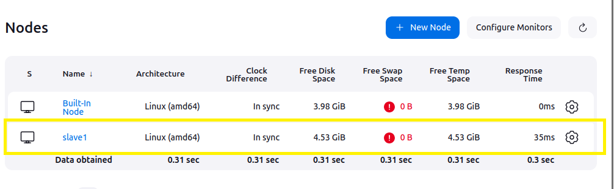

- Create a new newstyle project.....I gave the name as *docker_image_deploy*

   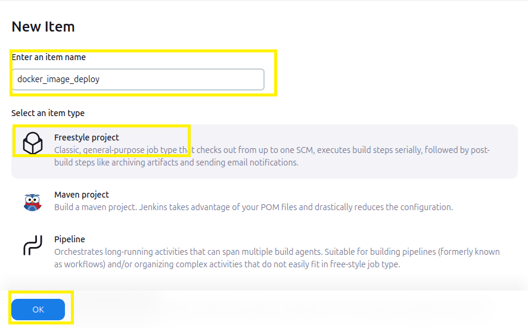

- Now, We have to mentioned where we should deploy.....So, **Restrict where this project can be run** we should mentiond the slave node label.

   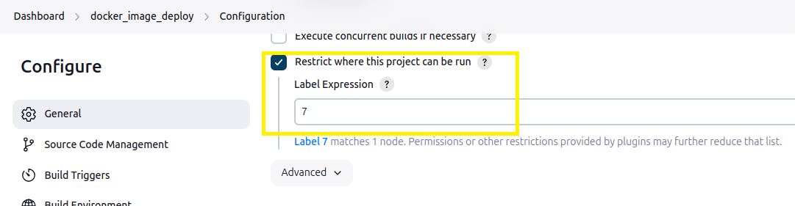

- I have a project source code on my github repo.....Give the repository information and credentials.

   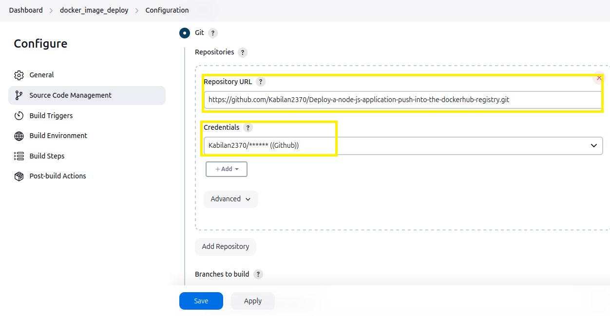
   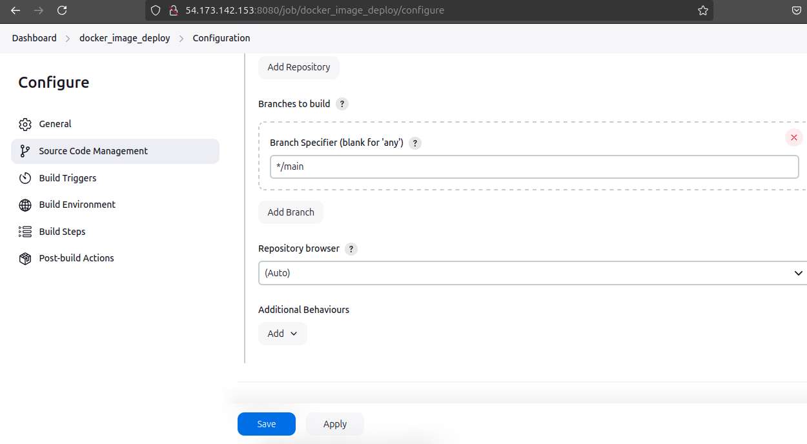

- On Build step,

    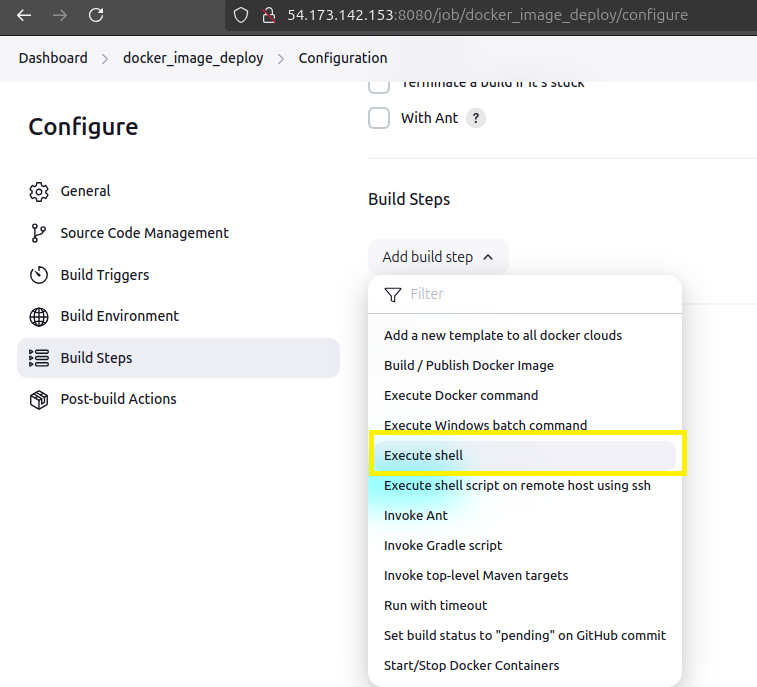
    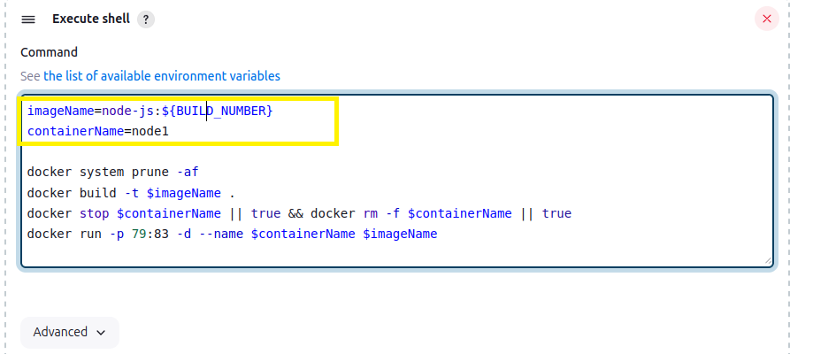

- Build a project.....successfully deploy a docker images and container on slave machine.

    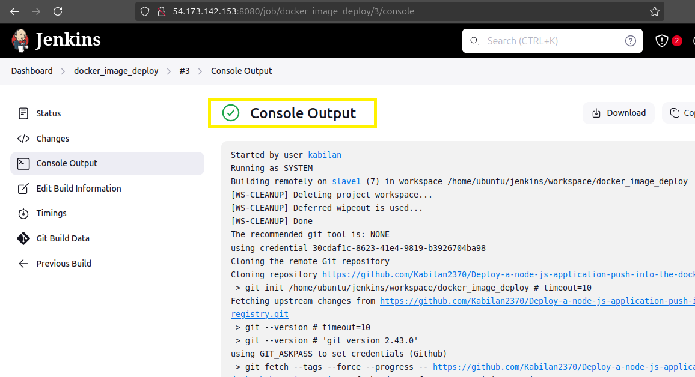
    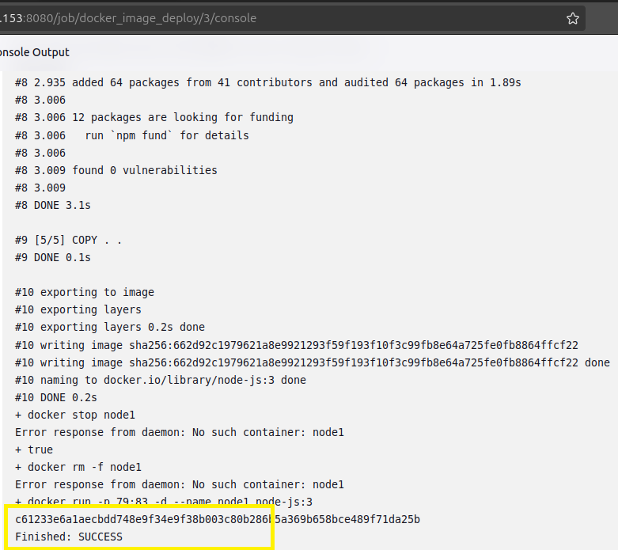

- Now, Let check on our slave machine ...

    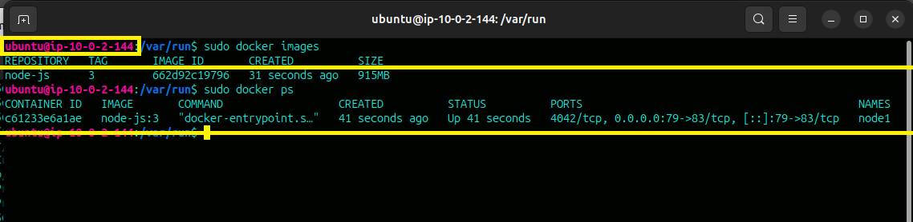
    
> Both image and container launched successfully on slave machine...         

>                                               Thankyou....
    
